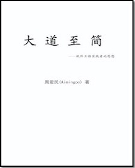
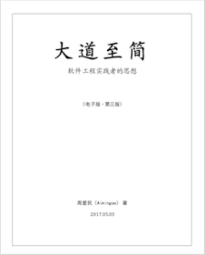
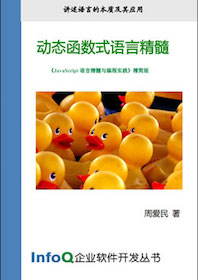
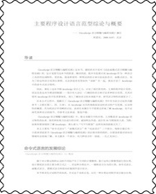
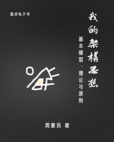
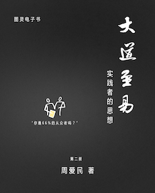

# My Ebooks

仅用于一些已发布的电子书或编目过的文章的下载。

  * [主要书目](#%E4%B8%BB%E8%A6%81%E4%B9%A6%E7%9B%AE)
    * [大道至简](#%E5%A4%A7%E9%81%93%E8%87%B3%E7%AE%80)
      * [[1] 第一版](#1-%E7%AC%AC%E4%B8%80%E7%89%88)
      * [[2] 第二、三版](#2-%E7%AC%AC%E4%BA%8C%E4%B8%89%E7%89%88)
    * [动态函数式语言精髓](#%E5%8A%A8%E6%80%81%E5%87%BD%E6%95%B0%E5%BC%8F%E8%AF%AD%E8%A8%80%E7%B2%BE%E9%AB%93)
    * [主要程序设计语言范型综论与概要](#%E4%B8%BB%E8%A6%81%E7%A8%8B%E5%BA%8F%E8%AE%BE%E8%AE%A1%E8%AF%AD%E8%A8%80%E8%8C%83%E5%9E%8B%E7%BB%BC%E8%AE%BA%E4%B8%8E%E6%A6%82%E8%A6%81)
    * [程序原本](#%E7%A8%8B%E5%BA%8F%E5%8E%9F%E6%9C%AC)
    * [我的架构思想](#%E6%88%91%E7%9A%84%E6%9E%B6%E6%9E%84%E6%80%9D%E6%83%B3)
    * [大道至易：实践者的思想（第二版）](#%E5%A4%A7%E9%81%93%E8%87%B3%E6%98%93%E5%AE%9E%E8%B7%B5%E8%80%85%E7%9A%84%E6%80%9D%E6%83%B3%E7%AC%AC%E4%BA%8C%E7%89%88)
  * [其它](#%E5%85%B6%E5%AE%83)

## 主要书目

### 大道至简

#### [1] 第一版

* 电子版（第一版）[下载](https://github.com/aimingoo/my-ebooks/raw/master/assets/Tao-Simplest-1_rel.2005.11.06.zip)
* 电子版幕后故事 [下载](https://github.com/aimingoo/my-ebooks/raw/master/assets/Tao-Simplest-Behind.zip)

下载位于assets目录中。

#### [2] 第二、三版

* 电子版（第二版）[下载](https://github.com/aimingoo/my-ebooks/releases/download/v1.0.0/Tao-Simplest-2_rel.2012.12.18.zip)
* 电子版（第三版）[下载](https://github.com/aimingoo/my-ebooks/releases/download/v1.0.2/Tao-Simplest-3_rel.2017.05.03.zip)
* 电子版（第三版）.mobi版本

下载位于releases中。

> Keyword: Tao-Simplest

### 动态函数式语言精髓

* 本书的部分内容曾以电子文档的形式发布为《主要程序设计语言范型综论与概要》。
* [下载](https://github.com/aimingoo/my-ebooks/raw/master/assets/Danamic-functional.zip)

下载位于assets目录中。

> 又名：《JavaScript语言精髓与编程实践》精简版
>
> Keyword: Danamic\_functional

### 主要程序设计语言范型综论与概要

* [下载](https://github.com/aimingoo/my-ebooks/raw/master/assets/Programming-paradigms.zip)

下载位于assets目录中。

> Keyword: programming\_paradigms

### 程序原本

* 高质量的PDF版本：[Elements_of_Program.zip](https://github.com/aimingoo/my-ebooks/raw/master/assets/Elements_of_Program.zip)
* 适用于Kindle的版本：[Elements_of_Program.azw3](https://github.com/aimingoo/my-ebooks/raw/master/assets/Elements_of_Program.azw3)
* 使用了SVG图的.epub版本：[Elements_of_Program.epub](https://github.com/aimingoo/my-ebooks/raw/master/assets/Elements_of_Program.epub)
* 一般质量图片的.epub版本：[Elements_of_Program-i.epub](https://github.com/aimingoo/my-ebooks/raw/master/assets/Elements_of_Program-i.epub)
* 低版本Kindle使用的阅读格式：[Elements_of_Program.mobi](https://github.com/aimingoo/my-ebooks/raw/master/assets/Elements_of_Program.mobi)

下载位于assets目录中。

> Keyword: Elements\_of\_Program

### 我的架构思想

* 高质量的PDF版本：[Thinking_in_Architecture.zip](https://github.com/aimingoo/my-ebooks/raw/master/assets/Thinking_in_Architecture.zip)
* 适用于Kindle的版本：[Thinking_in_Architecture.azw3](https://github.com/aimingoo/my-ebooks/raw/master/assets/Thinking_in_Architecture.azw3)
* 使用了SVG图的.epub版本：[Thinking_in_Architecture.epub](https://github.com/aimingoo/my-ebooks/raw/master/assets/Thinking_in_Architecture.epub)
* 一般质量图片的.epub版本：[Thinking_in_Architecture-i.epub](https://github.com/aimingoo/my-ebooks/raw/master/assets/Thinking_in_Architecture-i.epub)
* 低版本Kindle使用的阅读格式：[Thinking_in_Architecture.mobi](https://github.com/aimingoo/my-ebooks/raw/master/assets/Thinking_in_Architecture.mobi)

下载位于assets目录中。

> Keyword: Thinking_in_Architecture

### 大道至易：实践者的思想（第二版）

* 高质量的PDF版本：[Tao-Easy_and_Changes.zip](https://github.com/aimingoo/my-ebooks/raw/master/assets/Tao-Easy_and_Changes.zip)
* 适用于Kindle的版本：[Tao-Easy_and_Changes.azw3](https://github.com/aimingoo/my-ebooks/raw/master/assets/Tao-Easy_and_Changes.azw3)
* 使用了SVG图的.epub版本：[Tao-Easy_and_Changes.epub](https://github.com/aimingoo/my-ebooks/raw/master/assets/Tao-Easy_and_Changes.epub)
* 一般质量图片的.epub版本：[Tao-Easy_and_Changes-i.epub](https://github.com/aimingoo/my-ebooks/raw/master/assets/Tao-Easy_and_Changes-i.epub)
* 低版本Kindle使用的阅读格式：[Tao-Easy_and_Changes.mobi](https://github.com/aimingoo/my-ebooks/raw/master/assets/Tao-Easy_and_Changes.mobi)

下载位于assets目录中。

> Keyword: Tao-Easy_and_Changes

## 其它

...
